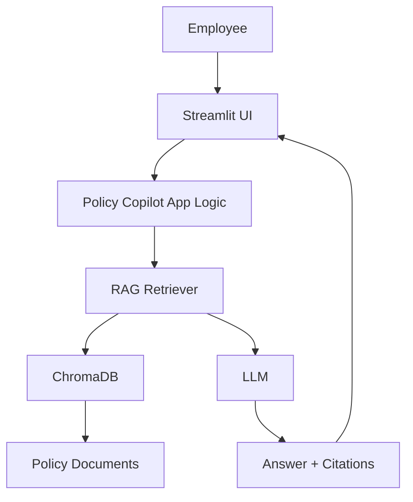

# Lab 01: Build a Simple Enterprise Copilot (Policy Q&A Only)

## 1. Lab Name

**Simple Enterprise Copilot for Employee Policy Questions**

## 2. Description

This is a beginner lab to build a **non-agent, single-turn Enterprise Copilot**.

The copilot will:

1. Accept an employee question.
2. Search internal HR policy documents with RAG.
3. Return a grounded answer with policy citations.

This lab intentionally avoids multi-step agents, tool orchestration, and conversational memory.

## 3. Use Case

### Business Scenario

Employees frequently ask policy questions such as:

- "How many annual leave days do I get?"
- "What is the sick leave policy?"
- "Can I carry forward unused leave?"

### Objective

Create a simple copilot where employees can ask policy questions and get reliable answers from internal policy documents.

## 4. Scope and Non-Scope

### In Scope

1. Single-turn question and answer.
2. RAG-based retrieval from policy files.
3. Source citations in the final response.

### Out of Scope

1. No agent planning or tool calling.
2. No ticket creation or workflow actions.
3. No conversation history or memory.

## 5. Learning Objectives

By the end of this lab, participants will be able to:

1. Explain a basic enterprise RAG architecture.
2. Build and index a small policy knowledge base.
3. Ask policy questions through a simple Streamlit UI.
4. Return answers grounded in internal policy content.

## 6. Architecture



## 7. Technology Stack

| Area | Technology |
| --- | --- |
| Language | Python 3.11+ |
| UI | Streamlit |
| LLM integration | langchain-openai |
| RAG framework | LangChain |
| Vector database | ChromaDB |
| Env management | python-dotenv |

## 8. Prerequisites

Install:

1. Python 3.11+
2. Git
3. VS Code
4. OpenAI API key

Verify Python:

```bash
python --version
```

## 9. Setup Steps

### Step 1: Create project folder

```bash
mkdir simple-enterprise-copilot
cd simple-enterprise-copilot
code .
```

### Step 2: Create virtual environment

```bash
python -m venv .venv
```

Windows:

```bash
.venv\Scripts\activate
```

Mac/Linux:

```bash
source .venv/bin/activate
```

### Step 3: Create `requirements.txt`

```text
streamlit
langchain
langchain-openai
langchain-community
langchain-text-splitters
langchain-chroma
chromadb
python-dotenv
```

Install dependencies:

```bash
pip install -r requirements.txt
```

### Step 4: Create `.env`

```env
OPENAI_API_KEY=your-openai-api-key
OPENAI_MODEL=gpt-4.1-mini
OPENAI_EMBEDDING_MODEL=text-embedding-3-small
```

### Step 5: Create `.gitignore`

```text
.venv/
.env
__pycache__/
chroma_db/
```

## 10. Folder Structure

```text
simple-enterprise-copilot/
├── app.py
├── rag.py
├── ingest.py
├── test_rag.py
├── knowledge_base/
│   ├── leave_policy.md
│   ├── attendance_policy.md
│   └── sick_leave_policy.md
├── chroma_db/
├── requirements.txt
├── .env
├── .gitignore
└── README.md
```

## 11. Create Knowledge Base Files

### File 1: `knowledge_base/leave_policy.md`

```markdown
# Leave Policy

Full-time employees are eligible for 24 days of annual leave per calendar year.

Unused leave up to 5 days can be carried forward to the next calendar year.

Annual leave requests must be submitted at least 3 working days in advance.
```

### File 2: `knowledge_base/sick_leave_policy.md`

```markdown
# Sick Leave Policy

Employees are eligible for 10 days of paid sick leave per calendar year.

A medical certificate is required for sick leave longer than 2 consecutive days.

Sick leave cannot be encashed.
```

### File 3: `knowledge_base/attendance_policy.md`

```markdown
# Attendance Policy

Core working hours are 10:00 AM to 4:00 PM on business days.

Employees must record attendance in the HR system daily.

Repeated late attendance may trigger manager review.
```

## 12. Implement RAG Module

Create `rag.py`:

```python
import os

from dotenv import load_dotenv
from langchain_chroma import Chroma
from langchain_openai import OpenAIEmbeddings

load_dotenv()

EMBEDDING_MODEL = os.getenv("OPENAI_EMBEDDING_MODEL", "text-embedding-3-small")


def get_vector_store():
    embeddings = OpenAIEmbeddings(model=EMBEDDING_MODEL)
    return Chroma(
        collection_name="employee_policies",
        embedding_function=embeddings,
        persist_directory="./chroma_db",
    )


def search_policies(query, k=3):
    return get_vector_store().similarity_search(query, k=k)
```

## 13. Implement Knowledge Ingestion

Create `ingest.py`:

```python
from pathlib import Path

from langchain_community.document_loaders import TextLoader
from langchain_text_splitters import RecursiveCharacterTextSplitter

from rag import get_vector_store


def load_documents():
    docs = []
    for file_path in Path("knowledge_base").glob("*.md"):
        loader = TextLoader(str(file_path), encoding="utf-8")
        loaded = loader.load()
        for doc in loaded:
            doc.metadata["source"] = file_path.name
        docs.extend(loaded)
    return docs


def ingest_documents():
    documents = load_documents()
    splitter = RecursiveCharacterTextSplitter(chunk_size=500, chunk_overlap=50)
    chunks = splitter.split_documents(documents)

    vector_store = get_vector_store()
    vector_store.add_documents(chunks)

    print("Policy knowledge base indexed successfully.")


if __name__ == "__main__":
    ingest_documents()
```

Run ingestion:

```bash
python ingest.py
```

## 14. Implement Simple Copilot App 

Create `app.py`:

```python
import os

import streamlit as st
from dotenv import load_dotenv
from langchain_openai import ChatOpenAI

from rag import search_policies

load_dotenv()

MODEL = os.getenv("OPENAI_MODEL", "gpt-4.1-mini")
llm = ChatOpenAI(model=MODEL, temperature=0)

st.set_page_config(page_title="Enterprise Policy Copilot")
st.title("Enterprise Policy Copilot")
st.caption("Simple RAG Q&A (No Agent, No Conversation Memory)")

question = st.text_area(
    "Ask a policy question",
    value="How many annual leave days are available and what is carry forward limit?",
    height=120,
)

if st.button("Ask Copilot", type="primary"):
    with st.spinner("Searching policies and preparing answer..."):
        docs = search_policies(question, k=3)

        context = "\n\n".join(doc.page_content for doc in docs)
        sources = sorted(set(doc.metadata.get("source", "Unknown") for doc in docs))

        prompt = f"""
You are an enterprise HR policy assistant.

Answer only from the provided policy context.
If the answer is not in context, say: "I do not have that policy information in the current knowledge base."

Question:
{question}

Policy Context:
{context}

Return a concise and professional answer.
"""

        response = llm.invoke(prompt)

    st.subheader("Copilot Answer")
    st.write(response.content)

    with st.expander("Citations"):
        for source in sources:
            st.write(f"- {source}")

    with st.expander("Retrieved Policy Context"):
        for doc in docs:
            st.write(f"Source: {doc.metadata.get('source', 'Unknown')}")
            st.write(doc.page_content)
            st.divider()
```

## 15. Optional RAG Console Test

Create `test_rag.py`:

```python
from rag import search_policies

results = search_policies("What is annual leave carry forward limit?")

for idx, doc in enumerate(results, start=1):
    print(f"Result {idx}: {doc.metadata.get('source', 'Unknown')}")
    print(doc.page_content)
    print("-" * 40)
```

Run:

```bash
python test_rag.py
```

## 16. Run the Application

```bash
python ingest.py
streamlit run app.py
```

Open:

```text
http://localhost:8501
```

## 17. Demo Script (10-12 Minutes)

1. Show policy files in `knowledge_base/`.
2. Run `python ingest.py` and explain indexing.
3. Start app with `streamlit run app.py`.
4. Ask leave policy question.
5. Ask sick leave question.
6. Show citations section and explain traceability.
7. Ask out-of-scope question to show safe fallback behavior.

## 18. Suggested Demo Prompts

1. "How many annual leave days do I get?"
2. "What is the sick leave certificate requirement?"
3. "Can I carry forward unused annual leave?"
4. "What is travel reimbursement policy for overseas conference?"

## 19. Validation Checklist

- Virtual environment activated.
- Dependencies installed successfully.
- `.env` configured with OpenAI key.
- Policy files created under `knowledge_base/`.
- `python ingest.py` runs successfully.
- `chroma_db/` generated.
- App responds with grounded policy answers.
- Citations are shown for each response.
- Unknown questions trigger fallback response.

## 20. Conclusion

This lab establishes the baseline enterprise copilot pattern:

```text
Simple Enterprise Copilot = LLM + RAG + Internal Policy Documents
```

It is a strong foundation before moving to advanced features such as multi-turn memory, action tools, guardrails, and full agent orchestration.
